# About Program
   
A small utility that allows you to grab/dump/take/get/~steal~ bytecode from a running Java Virtual Machine and save it to disk.  
It has a graphical interface, several output formats, compatible with JDK 1.8+, and includes a small preloader (bootstrap) to choose the Java runtime for launch, dark and light theme.

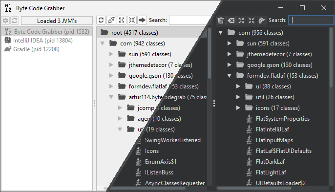

## Usage

> [!NOTE]
> Due to the nature of the application, a **JDK** (not a JRE) is required to run it.

If you launch the program on a JRE, bootstrap window will open and prompt you to select a JDK.  
> 

Enter the path to the JDK, for example: `C:\Program Files\Java\jdk1.8.0_231`  
**Launch** button will restart application using the specified JDK.  
If the launch fails, you will see the bootstrap window again.

### Main frame

After successful launch, you will see a list of running Java virtual machines.  
Select the target JVM, connect to it, then add classes you need to right-side panel using **Add to grab** button (rightmost button on left panel, or button in context menu of left panel).

| Light | Dark |
|:---:|:---:|
| 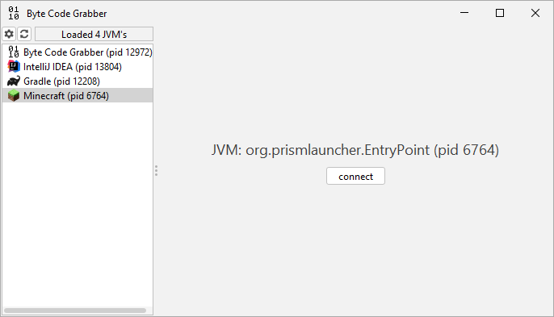 | 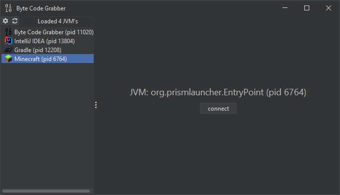 |
| 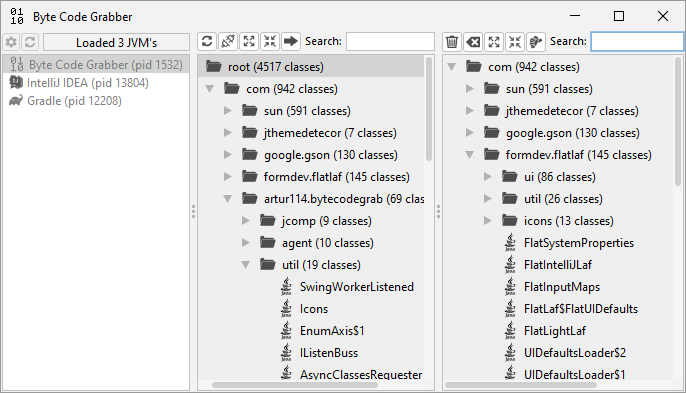 | 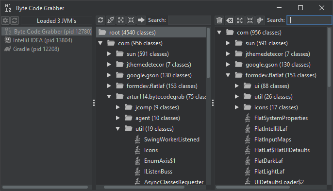 |

### Class grabbing

To save the selected classes, press the **Grab** button (rightmost button on right panel, or in context menu of the right panel).  
If the path written in text field on the right does not exist, a file selection window opens, select a `.zip`, `.jar` file, or folder.
After that, you will be asked to choose output directory and output format.  

| Light | Dark |
|:---:|:---:|
| 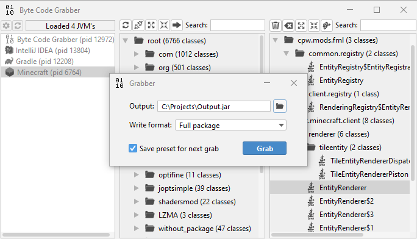 | 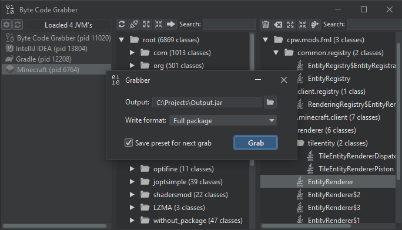 |

> [!NOTE]
> If a file with an unsupported extension is selected, extension will be automatically changed to `.jar`.

There are three output formats:

- **Full package:** Saves each class so that its package is used as the directory path. For example, class `java.util.List` becomes `java\util\List.class`.
- **Package + Class name:** Saves each class using full package + classname as the file name. For example, class `java.util.List` becomes `java.util.List.class`.
- **Just class name:** Saves each class using only its name, provided no file with that name already exists, otherwise uses: package + class name. For example, class `java.util.List` becomes `List.class`.

After you click the **Grab** button, program will save classes you selected to selected output resource.

| Light | Dark |
|:---:|:---:|
| 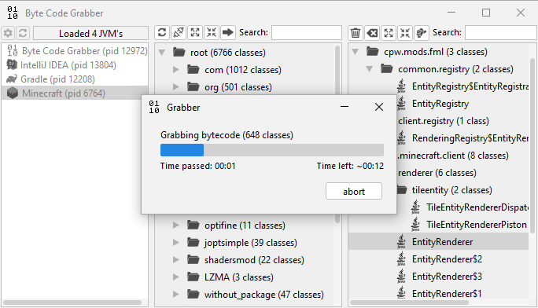 | 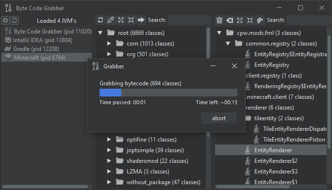 |
| 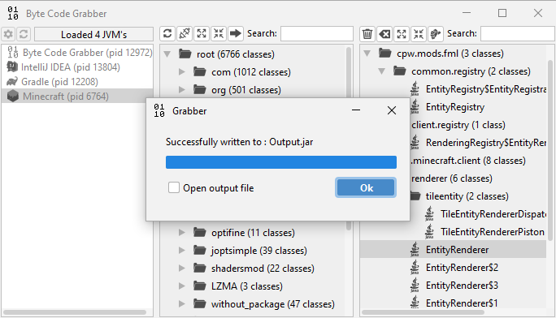 | 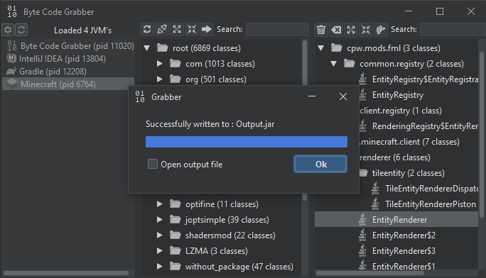 |

After saving the classes, you can disconnect from the virtual machine using the disconnect button (second button on left panel, or button in context menu of left panel)

### Other
**Theme chooser**   
| Light | Dark |
|:---:|:---:|
| 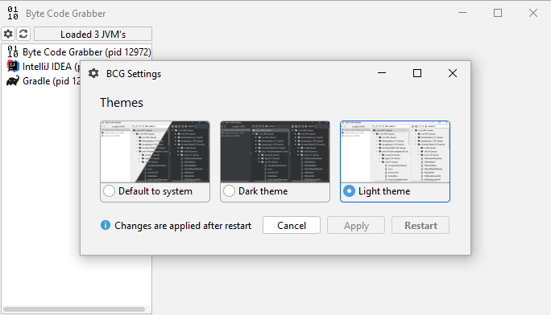 | 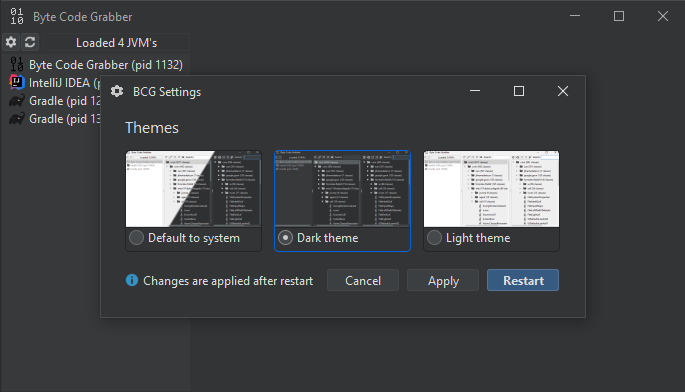 |

**Context menu**   

| Light | Dark |
|:---:|:---:|
| 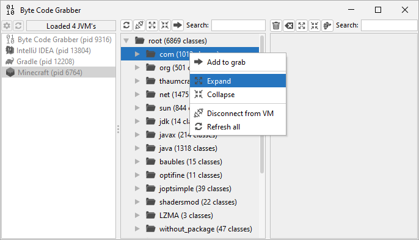 | 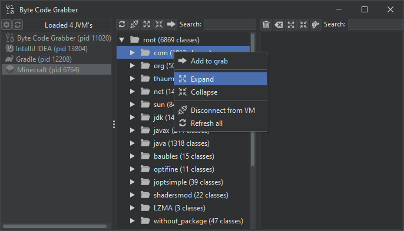 |
| 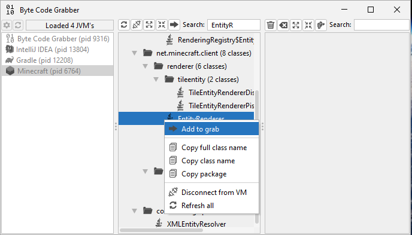 | 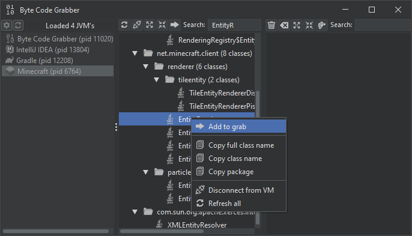 |
| 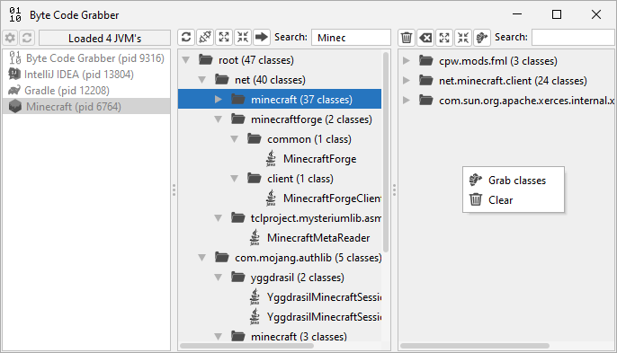 | 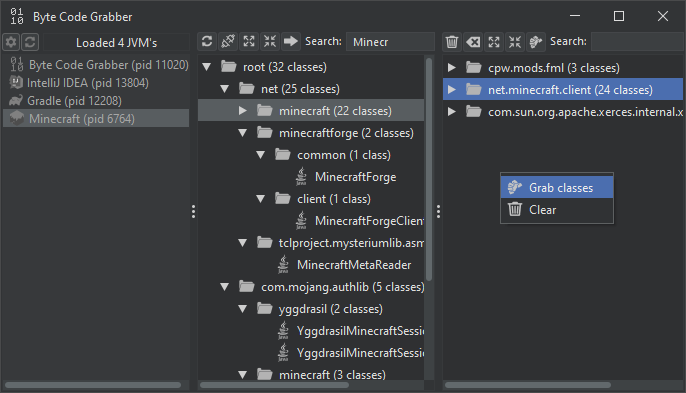 |

## Credits
jSystemThemeDetector is licensed under the Apache License 2.0, Copyright (c) 2020 Albin Coquereau.
FlatLaf is licensed under the Apache License 2.0. Copyright (c) 2019-2024 FormDev Software GmbH.  
Log4j is licensed under the Apache License 2.0, Copyright (c) The Apache Software Foundation.  
Gson is licensed under the Apache License 2.0, Copyright (c) 2008 Google Inc.  

Special thanks to [@JFormDesigner](https://github.com/JFormDesigner) for the wonderful Look & Feel ([FlatLaf](https://github.com/JFormDesigner/FlatLaf)).  
**Libraries:** FlatLaf, Gson, Log4j  
**Developer:** [@Artur114](https://github.com/Artur114Projects)
